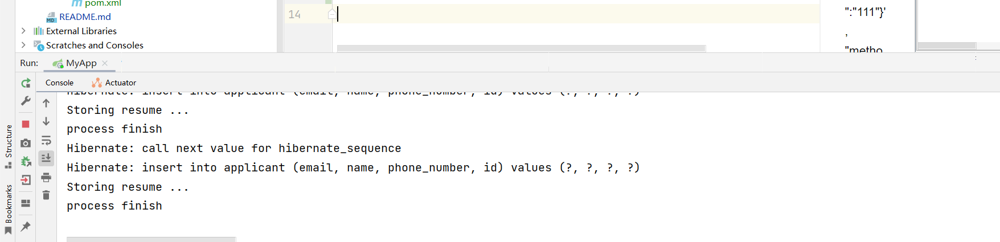
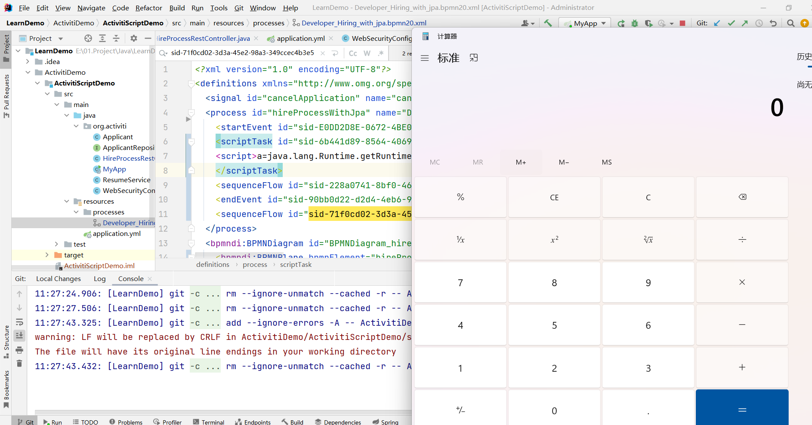
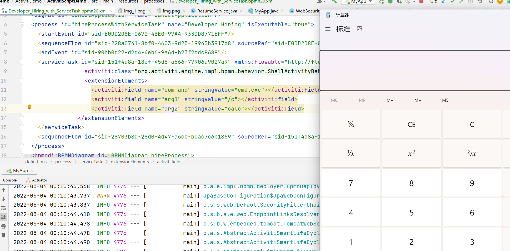

# LearnDemo
All this Demo is used by my blog : moonsec.top
## 提交方法
fetch("http://127.0.0.1:8088/start-hire-process", {
"headers": {
"content-type": "application/json"
},
"body": '{"name":"cn","email":"aaa@aaa.com","phoneNumber":"13913887631","id":"111"}',
"method": "POST",
"mode": "cors",
"credentials": "include"
}).then(r=>r.log);

## scriptTask RCE 
通过上述的fetch方式触发 RCE

## ServiceTask RCE
通过fetch方式触发RCE

